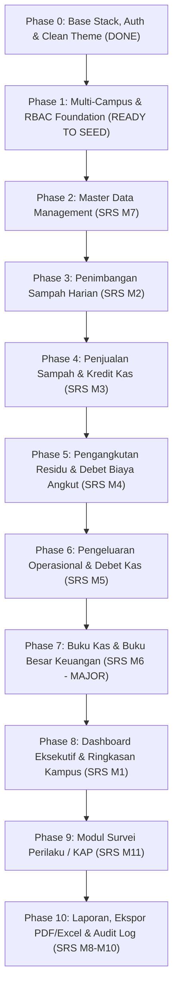

# 🗺️ Roadmap & Development Journey: Sistem Pengelolaan Sampah UAD (PS2) v2

Dokumen ini adalah panduan kerja bertahap (*step-by-step roadmap*), arsitektur teknis, checklist implementasi fitur, dan rencana pengujian proyek **Sistem Pengelolaan Sampah Kampus (PS2) & Survei Perilaku (KAP) Universitas Ahmad Dahlan**.
> **Status SRS**: Diperbarui mengacu pada **PS2 SRS New.pdf (Analisis Kebutuhan v2 — dengan Buku Kas & Buku Besar)**.

---

## 🎯 Prinsip Pengerjaan & Aturan Desain (GOLDEN RULES)
1. ⭐ **DRIBBLE CLEAN STYLE (WAJIB & UTAMA)**:
   - Desain minimalis, lapang (*spacious*), proporsional, tanpa ornamen alay atau elemen bertumpuk-tumpuk.
   - **NO EMOJI** pada antarmuka profesional (gunakan vektor SVG line/monokrom presisi tinggi).
   - Palet warna konsisten mengacu pada `ref/PS2_UAD_Prototype_UI.html`: **Sage Green (`#3a9d6e`)**, **Sky Blue (`#3b82f6`)**, **Amber (`#e5a520`)**, **Coral (`#ef6b4a`)**, cards putih (`#ffffff`), border halus (`border-slate-200`), dan background halaman bersih (`#f5f7fa`).
   - Tipografi terstandarisasi: **DM Sans** untuk teks antarmuka, **JetBrains Mono** untuk angka nominal uang & timbangan kg.
2. **Fokus Satu Per Satu (Single Feature Delivery)**: Selesaikan 1 fitur hingga tuntas, verifikasi/uji, baru pindah ke fitur selanjutnya.
3. **Kepatuhan SRS v2 & Non-AI Slop**: Struktur kode bersih mengikuti standar arsitektur resmi Laravel (Services, Observers, Scopes, Volt). Terapkan **DRY (Don't Repeat Yourself)** pada setiap komponen Blade dan PHP.
4. **Validasi Ganda (Double Validation)**:
   - **Frontend**: HTML5 attributes (`min`, `max`, `maxlength`, `required`) & responsif.
   - **Backend**: Strict Laravel validation rules, sanitasi input (`strip_tags`, `trim`), casting numerik aman.
5. **No Premature Docker / Push**: Eksekusi docker/migrasi/push dikendalikan manual oleh user agar tidak membebani perangkat lokal.

---

## 🧭 Milestone & Fase Pengerjaan (SRS v2 Aligned)

---

## 🏦 Arsitektur Baru Keuangan v2 (Model Buku Kas & Buku Besar)

### Perubahan Fundamental:
- **Dulu (v1)**: Saldo dihitung on-the-fly (`SUM(penjualan) - SUM(biaya)`). Rawan lambat dan tidak auditable.
- **Sekarang (v2)**: 
  1. **Tabel `keuangan` (Jurnal Buku Kas)**: Mencatat setiap mutasi keuangan dengan kolom `jenis` (K = Kredit/Pemasukan, D = Debet/Pengeluaran), `nominal`, `sumber` (`penjualan`, `pengangkutan`, `operasional`), `ref_id`, `keterangan`.
  2. **Tabel `buku_besar` (Saldo Harian Per Kampus)**: Menyimpan `saldo_awal`, `total_kredit`, `total_debet`, dan `saldo_akhir` per hari per kampus. Formula: `Saldo Akhir = Saldo Awal + Total Kredit - Total Debet`. Saldo akhir hari X otomatis menjadi saldo awal hari X+1.
  3. **Otomasi via Observers & `LedgerService`**:
     - Penjualan disimpan ➔ `SaleObserver` ➔ `LedgerService::recordTransaction('K', 'penjualan')` ➔ insert `keuangan` ➔ update/create `buku_besar`.
     - Pengangkutan disimpan ➔ `PickupObserver` ➔ hitung `volume * tarif` ➔ `LedgerService::recordTransaction('D', 'pengangkutan')` ➔ insert `keuangan` ➔ update/create `buku_besar`.
     - Pengeluaran disimpan ➔ `ExpenseObserver` ➔ `LedgerService::recordTransaction('D', 'operasional')` ➔ insert `keuangan` ➔ update/create `buku_besar`.

---

## 📋 Checklist Tiap Fase

### ✅ Phase 0: Base Stack, Auth & Clean Theme (STATUS: SELESAI)
- [x] Inisialisasi Laravel 12, Livewire 3 Volt, Spatie Permission, Tailwind CSS + DaisyUI.
- [x] Setting CI/CD runner VPS (`ps2.brotherzhafif.my.id`).
- [x] Landing Page, Login, Register dengan validasi ganda & rate limiting.
- [x] Tema clean light Dribbble (`#f5f7fa`, aksen Sage Green `#3a9d6e`, font DM Sans).
- [x] Favicon & Logo terstandarisasi PS2 UAD.

### ⏳ Phase 1: Multi-Campus & RBAC Foundation (STATUS: KODE SELESAI - MENUNGGU MIGRASI SERVER)
- [x] Migration `campuses` & foreign key `users.campus_id`.
- [x] Model `Campus` & relasi `User`.
- [x] Seeder `CampusSeeder` (Kampus 1–6 UAD).
- [x] Seeder `RolePermissionSeeder` (5 Roles & 5 Akun demo).
- [x] Dropdown kampus di halaman Register.
- [x] Header dashboard menampilkan badge unit kampus & role.

### ⏳ Phase 2: Master Data Management (SRS M7) (STATUS: KODE SELESAI - MENUNGGU MIGRASI SERVER)
- **Tabel**:
  - `waste_sources` (Sumber sampah: Area Taman, Kantin, Asrama, Rektorat, dll. per kampus).
  - `waste_types` (9 kategori granular: Organik Sisa Makanan, Sampah Taman, Kardus, Karton, Kertas HVS, Plastik Keras, Plastik Multilayer, Logam & Kaca, Residu; `default_price_per_kg`, `is_sellable`).
  - `vendors` (Vendor pengangkut residu, kontak, `cost_per_kg`).
  - `buyers` (Pengepul pembeli anorganik, kontak).
  - `expense_categories` (Kategori pengeluaran: Upah, Makan/Minum TPS, Alat, Material, Pakan, Obat P3K).
- **Komponen UI**:
  - Halaman terpadu `livewire.pages.master.index` dengan navigasi tab Dribbble clean.
  - CRUD Livewire dengan validasi ganda, sanitasi teks, dan konfirmasi hapus data.
- **Checklist Uji**:
  - [ ] Migration jalan tanpa error (`2026_10_08_000002_create_master_data_tables.php`).
  - [ ] Seeder `MasterDataSeeder` mengisi data awal dengan benar.
  - [ ] Tab navigasi berfungsi berpindah antar master data tanpa reload.
  - [ ] Tambah & edit titik sumber sampah, jenis sampah, vendor, dan pengepul berjalan realtime.

### ⏳ Phase 3: Penimbangan Sampah Harian (SRS M2) (STATUS: KODE SELESAI - MENUNGGU MIGRASI SERVER)
- **Tabel**: `weighing_sessions` & `weighing_items`.
- **Fitur**:
  - Form input penimbangan harian per kampus dan titik sumber lokasi.
  - Multi-row granular untuk seluruh 9 jenis sampah (Organik, Anorganik Terpilah, Residu).
  - Bobot timbangan (kg) & estimasi volume kubik (m³ opsional).
  - Validasi ganda: numeric positif, max limit, proteksi field kosong.
  - Dribbble Clean metric cards: Total timbang kg, stok terpilah siap jual, dan stok residu via `StockService`.
  - Riwayat sesi penimbangan dengan pagination, filter rentang tanggal, filter kampus, dan delete session.
- **Checklist Uji**:
  - [x] Migration `2026_10_08_000003_create_weighing_tables.php` dibuat rapi.
  - [x] Model `WeighingSession` & `WeighingItem` dengan relasi lengkap.
  - [x] Service `StockService` untuk agregasi stok sampah terpilah vs residu.
  - [x] Komponen Livewire `pages.weighing.index` & integrasi route `weighing`.
  - [x] Sidebar menu penimbangan aktif dan tersinkronisasi.
  - [x] Seeder `WeighingSeeder` dibuat dan didaftarkan ke `DatabaseSeeder`.

### 📌 Phase 4: Penjualan Sampah & Kredit Kas (SRS M3)
- **Tabel**: `sales` & `sale_items`.
- **Fitur**: Form transaksi penjualan ke pengepul, pengecekan stok tersedia, subtotal & total otomatis.
- **Otomasi**: Trigger `SaleObserver` ➔ buat jurnal Kredit (K) di `keuangan` ➔ update `buku_besar`.
- **Checklist Uji**:
  - [ ] Penjualan tidak boleh melebihi stok yang ada.
  - [ ] Jurnal Kredit dan saldo akhir bertambah otomatis.

### 📌 Phase 5: Pengangkutan Residu & Debet Biaya Angkut (SRS M4)
- **Tabel**: `pickups`.
- **Fitur**: Pencatatan pengangkutan residu oleh vendor, hitung biaya live (`volume * tarif_per_kg`).
- **Otomasi**: Trigger `PickupObserver` ➔ buat jurnal Debet (D) di `keuangan` ➔ update `buku_besar` (saldo berkurang).
- **Checklist Uji**:
  - [ ] Residu berkurang sesuai volume angkut.
  - [ ] Biaya otomatis tercatat di jurnal Debet.

### 📌 Phase 6: Pengeluaran Operasional & Debet Kas (SRS M5)
- **Tabel**: `expenses`.
- **Fitur**: Form input biaya operasional non-angkut (plastik/karung, konsumsi pekerja TPS, upah pilah, pakan ternak, dll).
- **Otomasi**: Trigger `ExpenseObserver` ➔ buat jurnal Debet (D) di `keuangan` ➔ update `buku_besar`.
- **Checklist Uji**:
  - [ ] Biaya angkut dilarang diinput di form ini.
  - [ ] Saldo buku besar berkurang otomatis.

### 📌 Phase 7: Buku Kas & Buku Besar Keuangan (SRS M6 - MAJOR v2)
- **Fitur**:
  - **Tab 1: Buku Kas (Jurnal Keuangan)**: Filter tanggal/jenis/sumber, tabel jurnal K/D, nominal, saldo running, badge K (hijau) & D (merah/oranye).
  - **Tab 2: Buku Besar (Saldo Harian)**: Tabel `Tanggal`, `Saldo Awal`, `Total Kredit (+)`, `Total Debet (-)`, `Saldo Akhir`.
  - KPI Cards: Total Kredit, Total Debet, Saldo Akhir, Total Transaksi.
- **Checklist Uji**:
  - [ ] Rekalkulasi saldo berurutan berjalan benar (`Saldo Akhir Hari X = Saldo Awal Hari X+1`).
  - [ ] Tidak ada entri manual langsung tanpa transaksi sumber (kecuali saldo awal setup pertama).

### 📌 Phase 8: Dashboard Eksekutif & Ringkasan Kampus (SRS M1)
- Selector kampus di topbar (Super Admin bisa melihat semua kampus atau filter per kampus).
- KPI: Total Berat (kg), Volume (m³), Stok Akumulasi, Saldo Kas (langsung dari `buku_besar.saldo_akhir`).
- Chart komposisi & tren timbulan.

### 📌 Phase 9: Modul Survei Perilaku / KAP (SRS M11)
- Form kuesioner publik (Demografi, Knowledge, Attitude, Practice, Satisfaction, Facilities/Barriers).
- Perhitungan skor otomatis & dashboard analitik indeks KAP (0–100).

### 📌 Phase 10: Laporan, Ekspor & Audit Trail (SRS M8, M9, M10)
- Ekspor PDF & Excel (rekap penimbangan, buku kas, buku besar).
- Notifikasi stok & audit log.
