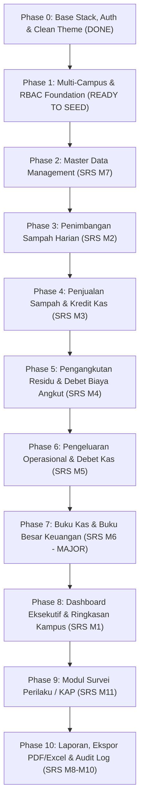

# 🗺️ Roadmap & Development Journey: Sistem Pengelolaan Sampah UAD (PS2) v2

Dokumen ini adalah panduan kerja bertahap (*step-by-step roadmap*), arsitektur teknis, checklist implementasi fitur, dan rencana pengujian proyek **Sistem Pengelolaan Sampah Kampus (PS2) & Survei Perilaku (KAP) Universitas Ahmad Dahlan**.
> **Status SRS**: Diperbarui mengacu pada **PS2 SRS New.pdf (Analisis Kebutuhan v2 — dengan Buku Kas & Buku Besar)**.

---

## 🎯 Prinsip Pengerjaan & Aturan Desain (GOLDEN RULES)
1. ⭐ **DRIBBLE CLEAN STYLE (WAJIB & UTAMA)**:
   - Desain minimalis, lapang (*spacious*), proporsional, tanpa ornamen alay atau elemen bertumpuk-tumpuk.
   - **NO EMOJI** pada antarmuka profesional (gunakan vektor SVG line/monokrom presisi tinggi).
   - Palet warna konsisten mengacu pada `ref/PS2_UAD_Prototype_UI.html`: **Sage Green (`#3a9d6e`)**, **Sky Blue (`#3b82f6`)**, **Amber (`#e5a520`)**, **Coral (`#ef6b4a`)**, cards putih (`#ffffff`), border halus (`border-slate-200`), dan background halaman bersih (`#f5f7fa`).
   - Tipografi terstandarisasi: **DM Sans** untuk teks antarmuka, **JetBrains Mono** untuk angka nominal uang & timbangan kg.
2. **Fokus Satu Per Satu (Single Feature Delivery)**: Selesaikan 1 fitur hingga tuntas, verifikasi/uji, baru pindah ke fitur selanjutnya.
3. **Kepatuhan SRS v2 & Non-AI Slop**: Struktur kode bersih mengikuti standar arsitektur resmi Laravel (Services, Observers, Scopes, Volt). Terapkan **DRY (Don't Repeat Yourself)** pada setiap komponen Blade dan PHP.
4. **Validasi Ganda (Double Validation)**:
   - **Frontend**: HTML5 attributes (`min`, `max`, `maxlength`, `required`) & responsif.
   - **Backend**: Strict Laravel validation rules, sanitasi input (`strip_tags`, `trim`), casting numerik aman.
5. **No Premature Docker / Push**: Eksekusi docker/migrasi/push dikendalikan manual oleh user agar tidak membebani perangkat lokal.

---

## 📜 Catatan Preferensi & Kontrak Desain Spesifik Pengguna (User Specific Notes & Contracts)

Seluruh implementasi fitur dan komponen wajib selalu mematuhi panduan spesifik ini:

1. **Modal Form Input & Backdrop Blur Viewport Penuh**:
   - Latar belakang gelap ber-efek blur modal (`backdrop-blur-sm`) wajib menutupi **100% viewport layar secara penuh** tanpa adanya rongga/celah bolong di bagian atas (`fixed inset-0 z-[9999] bg-slate-900/60 backdrop-blur-sm`).
   - Modal dibungkus menggunakan `<template x-teleport="body">` yang tidak bersyarat (*unconditional template*) dengan `x-show="showModal"`, `x-cloak`, dan `style="display: none;"` agar *reactivity lifecycle* Alpine.js tetap terjaga.
   - Tombol pembuka modal (`+ Catat ...`) wajib merespons instan 0ms melalui event Alpine langsung: `@click="showModal = true; $wire.openCreateModal()"`.

2. **Stabilitas Navigasi Antar Halaman (Anti-Freeze / Anti-Hang)**:
   - Dilarang keras menggunakan `wire:navigate` pada menu navigasi sidebar maupun tautan kartu aksi cepat (*quick action cards*) dashboard jika menyebabkan putusnya koneksi Alpine/Livewire morphdom yang berujung pada halaman membeku (*freeze*).
   - Gunakan navigasi tautan browser standar yang bersih, cepat, dan reliabel.

3. **Penyelarasan Warna & Komponen (Dribbble Clean Light Tokens)**:
   - Seluruh halaman dan komponen wajib konsisten mengadopsi tema terang bersih (*clean light*): latar belakang `#f5f7fa`, card putih berbingkai `border-slate-200`, aksen Sage Green (`#3a9d6e` / emerald), Sky Blue, dan Amber.
   - Dilarang memuat elemen bertema gelap (*dark mode clash* seperti `dark:bg-gray-800` pada pagination atau dropdown) agar antarmuka tidak belang.
   - Komponen nomor halaman aktif menggunakan aksen kontras yang jelas, sedangkan tombol nomor tidak aktif berlatar putih dengan border slate halus.

4. **Desain Tabel Ringkas & Modal Detail Interaktif (Anti-Scrolling Tinggi)**:
   - Tabel riwayat data (Penimbangan, Penjualan, Pengangkutan) dilarang memiliki tinggi baris yang berlebihan (*excessive row height*) yang memaksa pengguna melakukan scroll terlalu jauh ke bawah.
   - Kolom yang memuat banyak rincian multi-item diringkas menjadi *compact summary badge* (contoh: `3 Jenis Tervalidasi`, `2 Jenis Terpilah`).
   - Rincian komprehensif data dibuka melalui Pop-up Modal Detail Interaktif yang rapi dengan mengklik tombol aksi ikon mata (*eye button*).

5. **Navigasi Pagination Independen In-Place (Anti Full-Reload)**:
   - Perpindahan nomor halaman (halaman 1, 2, 3 atau panah kiri/kanan) **dilarang me-reload halaman browser atau melompat/scroll paksa ke atas layar** (`scrollTo => false`).
   - Tabel data harus bertindak sebagai objek independen yang me-refresh datanya sendiri di tempat secara *in-place*.
   - Disediakan *smooth loading overlay* lokal di atas tabel (`Memperbarui data...`) dengan `wire:loading` agar pengguna mendapat umpan balik visual bahwa proses pembaruan data sedang berlangsung cepat dan hanya fokus pada tabel tersebut.
   - Seluruh tombol pagination (panah dan nomor numerik) wajib memiliki proteksi `wire:loading.attr="disabled"` untuk mencegah *race condition* atau klik berulang saat data sedang dimuat.

6. **Otorisasi Multi-Role & Scoping Cabang Kampus**:
   - Super Admin & Auditor/Pimpinan memiliki filter fleksibel untuk melihat "Semua Kampus" atau memilih unit kampus tertentu.
   - Operator Lapangan / Petugas TPS terkunci otomatis (*strictly scoped*) pada unit kampusnya sendiri, baik pada form input, tabel ringkasan, maupun agregat data.

7. **Batas Jumlah Baris Tabel Ringkas (Tepat 8 Data Per Halaman)**:
   - Seluruh halaman yang menampilkan list data view (Penimbangan, Penjualan, Pengangkutan, Pengeluaran, Buku Kas & Buku Besar) **wajib dibatasi tepat 8 data per halaman** (`paginate(8)`).
   - Dilarang menampilkan 10 atau 15 baris per halaman guna menjaga proporsi tinggi layar tetap ergonomis, mencegah scrolling berlebih, dan menjaga tampilan tetap rapi serta seimbang di berbagai resolusi layar.

---

## 🧭 Milestone & Fase Pengerjaan (SRS v2 Aligned)

---

## 🏦 Arsitektur Baru Keuangan v2 (Model Buku Kas & Buku Besar)

### Perubahan Fundamental:
- **Dulu (v1)**: Saldo dihitung on-the-fly (`SUM(penjualan) - SUM(biaya)`). Rawan lambat dan tidak auditable.
- **Sekarang (v2)**: 
  1. **Tabel `keuangan` (Jurnal Buku Kas)**: Mencatat setiap mutasi keuangan dengan kolom `jenis` (K = Kredit/Pemasukan, D = Debet/Pengeluaran), `nominal`, `sumber` (`penjualan`, `pengangkutan`, `operasional`), `ref_id`, `keterangan`.
  2. **Tabel `buku_besar` (Saldo Harian Per Kampus)**: Menyimpan `saldo_awal`, `total_kredit`, `total_debet`, dan `saldo_akhir` per hari per kampus. Formula: `Saldo Akhir = Saldo Awal + Total Kredit - Total Debet`. Saldo akhir hari X otomatis menjadi saldo awal hari X+1.
  3. **Otomasi via Observers & `LedgerService`**:
     - Penjualan disimpan ➔ `SaleObserver` ➔ `LedgerService::recordTransaction('K', 'penjualan')` ➔ insert `keuangan` ➔ update/create `buku_besar`.
     - Pengangkutan disimpan ➔ `PickupObserver` ➔ hitung `volume * tarif` ➔ `LedgerService::recordTransaction('D', 'pengangkutan')` ➔ insert `keuangan` ➔ update/create `buku_besar`.
     - Pengeluaran disimpan ➔ `ExpenseObserver` ➔ `LedgerService::recordTransaction('D', 'operasional')` ➔ insert `keuangan` ➔ update/create `buku_besar`.

---

## 📋 Checklist Tiap Fase

### ✅ Phase 0: Base Stack, Auth & Clean Theme (STATUS: SELESAI)
- [x] Inisialisasi Laravel 12, Livewire 3 Volt, Spatie Permission, Tailwind CSS + DaisyUI.
- [x] Setting CI/CD runner VPS (`ps2.brotherzhafif.my.id`).
- [x] Landing Page, Login, Register dengan validasi ganda & rate limiting.
- [x] Tema clean light Dribbble (`#f5f7fa`, aksen Sage Green `#3a9d6e`, font DM Sans).
- [x] Favicon & Logo terstandarisasi PS2 UAD.

### ⏳ Phase 1: Multi-Campus & RBAC Foundation (STATUS: KODE SELESAI - MENUNGGU MIGRASI SERVER)
- [x] Migration `campuses` & foreign key `users.campus_id`.
- [x] Model `Campus` & relasi `User`.
- [x] Seeder `CampusSeeder` (Kampus 1–6 UAD).
- [x] Seeder `RolePermissionSeeder` (5 Roles & 5 Akun demo).
- [x] Dropdown kampus di halaman Register.
- [x] Header dashboard menampilkan badge unit kampus & role.

### ⏳ Phase 2: Master Data Management (SRS M7) (STATUS: KODE SELESAI - MENUNGGU MIGRASI SERVER)
- **Tabel**:
  - `waste_sources` (Sumber sampah: Area Taman, Kantin, Asrama, Rektorat, dll. per kampus).
  - `waste_types` (9 kategori granular: Organik Sisa Makanan, Sampah Taman, Kardus, Karton, Kertas HVS, Plastik Keras, Plastik Multilayer, Logam & Kaca, Residu; `default_price_per_kg`, `is_sellable`).
  - `vendors` (Vendor pengangkut residu, kontak, `cost_per_kg`).
  - `buyers` (Pengepul pembeli anorganik, kontak).
  - `expense_categories` (Kategori pengeluaran: Upah, Makan/Minum TPS, Alat, Material, Pakan, Obat P3K).
- **Komponen UI**:
  - Halaman terpadu `livewire.pages.master.index` dengan navigasi tab Dribbble clean.
  - CRUD Livewire dengan validasi ganda, sanitasi teks, dan konfirmasi hapus data.
- **Checklist Uji**:
  - [ ] Migration jalan tanpa error (`2026_10_08_000002_create_master_data_tables.php`).
  - [ ] Seeder `MasterDataSeeder` mengisi data awal dengan benar.
  - [ ] Tab navigasi berfungsi berpindah antar master data tanpa reload.
  - [ ] Tambah & edit titik sumber sampah, jenis sampah, vendor, dan pengepul berjalan realtime.

### ⏳ Phase 3: Penimbangan Sampah Harian (SRS M2) (STATUS: KODE SELESAI - MENUNGGU MIGRASI SERVER)
- **Tabel**: `weighing_sessions` & `weighing_items`.
- **Fitur**:
  - Form input penimbangan harian per kampus dan titik sumber lokasi.
  - Multi-row granular untuk seluruh 9 jenis sampah (Organik, Anorganik Terpilah, Residu).
  - Bobot timbangan (kg) & estimasi volume kubik (m³ opsional).
  - Validasi ganda: numeric positif, max limit, proteksi field kosong.
  - Dribbble Clean metric cards: Total timbang kg, stok terpilah siap jual, dan stok residu via `StockService`.
  - Riwayat sesi penimbangan dengan pagination, filter rentang tanggal, filter kampus, dan delete session.
- **Checklist Uji**:
  - [x] Migration `2026_10_08_000003_create_weighing_tables.php` dibuat rapi.
  - [x] Model `WeighingSession` & `WeighingItem` dengan relasi lengkap.
  - [x] Service `StockService` untuk agregasi stok sampah terpilah vs residu.
  - [x] Komponen Livewire `pages.weighing.index` & integrasi route `weighing`.
  - [x] Sidebar menu penimbangan aktif dan tersinkronisasi.
  - [x] Seeder `WeighingSeeder` dibuat dan didaftarkan ke `DatabaseSeeder`.

### ⏳ Phase 4: Penjualan Sampah & Kredit Kas (SRS M3) (STATUS: KODE SELESAI - MENUNGGU MIGRASI SERVER)
- **Tabel**: `sales`, `sale_items`, `keuangan` (Buku Kas K/D), dan `buku_besar` (Saldo Harian Per Kampus).
- **Fitur**:
  - Validasi batas stok terpilah (`StockService::getAvailableStock`): Penjualan tidak boleh melebihi stok yang ada di TPS kampus.
  - Multi-row penjualan jenis sampah dengan live subtotal & grand total.
  - Otomasi pembukuan via `SaleObserver` ➔ `LedgerService::recordTransaction('K', 'penjualan')` ➔ auto insert `keuangan` (Kredit) ➔ auto update saldo akhir di `buku_besar`.
  - Tampilan Dribbble Clean: Kartu metrik pendapatan terdata, total berat terjual, sisa stok terpilah, modal input, dan modal konfirmasi hapus seragam.
- **Checklist Uji**:
  - [x] Migration `2026_10_08_000004_create_sales_and_ledger_tables.php` dibuat rapi.
  - [x] Model `Sale`, `SaleItem`, `Keuangan`, dan `BukuBesar` beserta relasi lengkap.
  - [x] Service `LedgerService` untuk double-entry bookkeeping akurat.
  - [x] Service `StockService` di-upgrade untuk memperhitungkan pengurangan penjualan.
  - [x] `SaleObserver` dibuat dan didaftarkan di `AppServiceProvider`.
  - [x] Komponen Livewire `pages.sales.index` & integrasi route `sales`.
  - [x] Navigasi menu Penjualan di sidebar aktif dengan status ikon tersinkronisasi.
  - [x] Seeder `SaleSeeder` dibuat dan didaftarkan ke `DatabaseSeeder`.

### ✅ Phase 5: Pengangkutan Residu & Debet Biaya Angkut (SRS M4) (STATUS: SELESAI & TERUJI)
- **Tabel**: `pickups`.
- **Fitur**: Pencatatan pengangkutan residu oleh vendor, hitung biaya live (`volume * tarif_per_kg`).
- **Otomasi**: Trigger `PickupObserver` ➔ buat jurnal Debet (D) di `keuangan` ➔ update `buku_besar` (saldo berkurang).
- **Checklist Uji**:
  - [x] Residu berkurang sesuai volume angkut via `StockService`.
  - [x] Biaya otomatis tercatat di jurnal Debet (`PickupObserver`).
  - [x] Komponen Livewire `pages.pickups.index` dengan modal teleport full backdrop, compact rows, dan independent in-place pagination.

### ✅ Phase 6: Pengeluaran Operasional & Debet Kas (SRS M5) (STATUS: SELESAI)
- **Tabel**: `expenses`.
- **Fitur**: Form input biaya operasional non-angkut (karung/bagor, konsumsi pekerja TPS, upah pilah, pakan ternak/maggot, material alat TPS).
- **Otomasi**: Trigger `ExpenseObserver` ➔ buat jurnal Debet (D) di `keuangan` ➔ update `buku_besar`.
- **Checklist Uji**:
  - [x] Migration `2026_10_08_000006_create_expenses_table.php` & model `Expense`.
  - [x] Observer `ExpenseObserver` terdaftar di `AppServiceProvider`.
  - [x] Seeder `ExpenseSeeder` terdaftar di `DatabaseSeeder`.
  - [x] Komponen Livewire `pages.expenses.index` & route `expenses`.
  - [x] Navigasi menu Pengeluaran di sidebar aktif dan quick card dashboard terhubung.

### ✅ Phase 7: Buku Kas & Buku Besar Keuangan (SRS M6 - MAJOR v2) (STATUS: SELESAI)
- **Fitur**:
  - **Tab 1: Buku Kas (Jurnal Keuangan)**: Filter tanggal/jenis/sumber, tabel jurnal K/D, nominal, badge K (hijau) & D (merah/oranye), modal rincian transaksi.
  - **Tab 2: Buku Besar (Saldo Harian)**: Tabel `Tanggal`, `Saldo Awal`, `Total Kredit (+)`, `Total Debet (-)`, `Saldo Akhir`.
  - Inisialisasi Saldo Kas Awal (`sumber = 'saldo_awal'`, `jenis = 'K'`) via modal popup.
  - KPI Cards: Saldo Kas Sirkular, Total Kredit, Biaya Angkut, Biaya Operasional.
- **Checklist Uji**:
  - [x] Model `Keuangan`, `BukuBesar`, dan service `LedgerService` double-entry bookkeeping.
  - [x] Komponen Livewire `pages.finance.index` & route `finance`.
  - [x] Navigasi menu Buku Kas di sidebar aktif dan quick card dashboard terhubung.
  - [x] Rekalkulasi saldo berurutan berjalan benar (`Saldo Akhir Hari X = Saldo Awal Hari X+1`).

### ✅ Phase 8: Dashboard Eksekutif & Ringkasan Kampus (SRS M1) (STATUS: SELESAI & TERINTEGRASI)
- **Fitur**:
  - Selector kampus terintegrasi di header (Super Admin & Auditor fleksibel memilih Semua Kampus atau per unit cabang; Operator terkunci otomatis).
  - 6 KPI Cards Primer: Timbangan Hari Ini (kg), Total Akumulasi (kg & m³), Stok Terpilah Anorganik (kg), Stok Residu TPA (kg), Diversion Rate (% pengalihan dari TPA), Saldo Kas Sirkular Realtime (Rp).
  - Visual Histogram Bar: Tren Timbulan Sampah Masuk 7 Hari Terakhir (clean SVG/CSS responsif dengan indikator hari ini & tooltip hover kg).
  - Stacked Segmented Composition Bar: Rasio Organik vs Anorganik vs Residu dengan persentase & kg breakdown.
  - Kartu Neraca Sirkular Keuangan TPS: Penjualan vs Biaya Angkut vs Biaya Operasional vs Saldo Kas Bersih.
  - Unified Tabbed Feed Aktivitas Operasional: Tab Timbangan, Penjualan, Pengangkutan, dan Pengeluaran terkini dengan shortcut tautan ke masing-masing modul.
  - Quick Action Hub: 5 kartu akses cepat modul operasional.
- **Checklist Uji**:
  - [x] Komponen Livewire `pages.dashboard.index` diperbarui penuh.
  - [x] Filter kampus reaktif dengan state Livewire.
  - [x] Tampilan Dribbble light tokens konsisten tanpa dark-mode clash.
  - [x] Seluruh link navigasi native bebas wire:navigate freeze.

### ✅ Phase 9: Modul Survei Perilaku / KAP (SRS M11) (STATUS: SELESAI & TERUJI)
- **Fitur**:
  - Migration `2026_10_08_000007_create_kap_surveys_table.php` & Model `KapSurvey`.
  - Form Publik Kuesioner Interaktif (`/survei-kap`) untuk seluruh civitas akademika (Mahasiswa, Dosen, Tendik).
  - Algoritma scoring otomatis:
    - Normalisasi dimensi: Knowledge Score, Attitude Score, Practice Score (0–100%).
    - Indeks KAP Keseluruhan & klasifikasi kategori: Sangat Baik (>=80), Cukup/Sedang (60-79.9), Kurang (<60).
  - Layar hasil skor instan bagi responden dengan breakdown dimensi dan apresiasi zero-waste.
  - Dashboard Analitik Internal (`/kap`):
    - 5 KPI Cards: Total Responden, Indeks KAP Kampus, Rata-rata Pengetahuan (K), Sikap (A), Perilaku (P).
    - Grafik Gap Dimensi Komparatif & Distribusi Tingkat Kesadaran.
    - Filter Unit Kampus, Peran Responden, Kategori, dan Rentang Tanggal.
    - Tabel Responden Terpadu: Independent in-place pagination, dibatasi tepat 8 baris per halaman (`paginate(8)`).
    - Modal Detail Rincian Jawaban Responden dengan `<template x-teleport="body">` dan full backdrop blur 100%.
    - Tombol Salin Tautan Survei & Buka Form Publik.
  - Seeder `KapSurveySeeder` dengan responden realistis lintas kampus UAD.
- **Checklist Uji**:
  - [x] Migration, Model, Seeder `KapSurvey` dibuat dan terdaftar.
  - [x] Route publik `survei-kap` & route internal `kap`.
  - [x] Komponen Livewire `pages.kap.survey` & `pages.kap.index`.
  - [x] Menu sidebar & quick card dashboard terhubung.

### 📌 Phase 10: Laporan, Ekspor & Audit Trail (SRS M8, M9, M10)
- Ekspor PDF & Excel (rekap penimbangan, buku kas, buku besar).
- Notifikasi stok & audit log.
