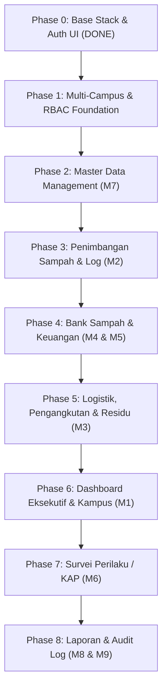

# 🗺️ Roadmap & Development Journey: Sistem Pengelolaan Sampah UAD (PS2)

Dokumen ini adalah panduan kerja bertahap (*step-by-step roadmap*), checklist implementasi fitur, rencana pengujian, dan riwayat progress pengerjaan proyek **Sistem Pengelolaan Sampah Kampus (PS2) & Survei Perilaku (KAP) Universitas Ahmad Dahlan**.

Prinsip Pengerjaan:
1. **Satu per Satu (Focus on Single Feature)**: Tidak menumpuk banyak fitur sekaligus. Selesaikan satu sub-fitur hingga tuntas, verifikasi/uji, lalu lanjut ke berikutnya.
2. **Double Validation**: Validasi ganda di sisi Frontend (HTML5 / Livewire realtime constraints) dan Backend (Laravel FormRequest / validation rules, sanitasi input).
3. **Komponen Siap Pakai**: Memanfaatkan **DaisyUI (Emerald Theme)** dan Tailwind CSS dengan subtle styling ala Dribbble.
4. **No Premature Docker/Push**: Pembuatan kode dilakukan di file lokal, eksekusi build/push/container migration dikontrol sesuai izin user agar tidak memberatkan perangkat lokal.

---

## 🧭 Milestone & Fase Pengerjaan

---

## 📋 Detail Tiap Fase & Checklist Pengujian

### ✅ Phase 0: Base Stack, Branding & Authentication UI (STATUS: SELESAI)
- [x] Inisialisasi Laravel 12, Livewire 3 + Volt, Spatie Permission, Tailwind CSS + DaisyUI.
- [x] Setup Docker multi-container (`ps2-app`, `ps2-web`, `ps2-db`, `ps2-vite`, `ps2-dozzle`).
- [x] Setup CI/CD Runner di VPS Oracle (`https://ps2.brotherzhafif.my.id`).
- [x] Redesign Landing Page (`welcome.blade.php`) dengan DaisyUI hero, stats, dan cards.
- [x] Redesign Halaman Login (`login.blade.php`) dengan validasi frontend/backend & rate limiting.
- [x] Redesign Halaman Register (`register.blade.php`) dengan validasi ketat.
- [x] Desain Favicon dan Logo seragam PS2 UAD (`favicon.svg`, `application-logo.blade.php`).

---

### ⏳ Phase 1: Multi-Campus & Role-Based Access Foundation (STATUS: KODE SIAP / MENUNGGU MIGRASI & VERIFIKASI)
Tujuan: Menyiapkan entitas Kampus (Kampus 1–6) dan hak akses (Role & Permission) agar user yang login memiliki konteks data kampus.

- **Tasks**:
  1. [x] Buat migration tabel `campuses` dan penambahan foreign key `campus_id` di tabel `users` (`2026_10_08_000001_create_campuses_and_add_to_users_table.php`).
  2. [x] Buat Model `Campus` & relasinya di `User` (`belongsTo` Campus dan `hasMany` Users).
  3. [x] Buat Seeder `CampusSeeder` (Kampus 1 hingga Kampus 6 UAD lengkap).
  4. [x] Buat Seeder `RolePermissionSeeder` lengkap dengan permissions, roles (Super Admin, Operator Timbangan, Koordinator TPS3R, Pengurus Bank Sampah, Auditor/Pimpinan), dan 5 akun demo.
  5. [x] Daftarkan seeder di `DatabaseSeeder.php`.
  6. [x] Tambahkan dropdown pemilihan kampus pada form **Register** (`register.blade.php`) dengan validasi frontend/backend.
  7. [x] Redesign **Dashboard** (`dashboard.blade.php`) menampilkan badge kampus & role aktif user.

- **Checklist Uji / Verifikasi**:
  - [ ] Jalankan migration & seeder (`php artisan migrate --seed`).
  - [ ] Cek 6 data kampus UAD terisi di database.
  - [ ] Coba registrasi user baru dengan memilih kampus di form Register.
  - [ ] Login menggunakan akun demo (misal: `operator@uad.ac.id` / `password123`) dan pastikan nama kampus serta rolenya muncul di header dashboard.

---

### 📌 Phase 2: Master Data Management (SRS M7)
Tujuan: Menyediakan antarmuka CRUD master data untuk admin kampus.

- **Fitur yang Dibuat**:
  1. Master Kategori Sampah (`waste_categories`): Organik, Anorganik Terpilah, Residu, B3.
  2. Master Jenis Sampah (`waste_types`): Plastik PET, Kardus, Duplek, Kaleng, Daun/Sisa Makanan, Residu Campur, dll. beserta field `is_sellable` dan `price_per_kg_default`.
  3. Master Titik Sumber Sampah (`waste_sources`): Gedung A, Kantin, Laboratorium, Asrama, TPS Kampus.
  4. Master Pengepul / Pihak Ketiga (`buyers`).
- **Checklist Uji**:
  - [ ] Validasi input nama kategori/jenis (tidak boleh duplikat per kampus).
  - [ ] Konfirmasi modal/dialog sebelum hapus data (cegah accidental deletion).
  - [ ] Filter & pagination tabel via Livewire realtime tanpa refresh.

---

### 📌 Phase 3: Penimbangan Sampah & Logistik Harian (SRS M2)
Tujuan: Memfasilitasi operator lapangan mencatat timbangan sampah masuk per titik sumber.

- **Fitur yang Dibuat**:
  1. Tabel `weighing_transactions` & `weighing_items`.
  2. Form input penimbangan (pilih tanggal, shift, titik sumber, jenis sampah, berat kg, catatan).
  3. Validasi angka berat (numerik positif, batas realistis max 5000 kg).
  4. Log riwayat penimbangan per kampus dengan filter tanggal.
- **Checklist Uji**:
  - [ ] Input berat negatif atau teks ditolak oleh validasi frontend & backend.
  - [ ] Perhitungan total timbangan harian terakumulasi akurat.
  - [ ] Scoping data: Operator Kampus 1 hanya melihat catatan timbangan Kampus 1.

---

### 📌 Phase 4: Bank Sampah & Keuangan Penjualan (SRS M4 & M5)
Tujuan: Pencatatan penjualan anorganik terpilah ke pengepul & arus kas sirkular.

- **Fitur yang Dibuat**:
  1. Tabel `waste_sales` & `sale_items`.
  2. Tabel pengeluaran operasional `operational_expenses`.
  3. Kalkulasi stok terpilah: `SUM(weighing) - SUM(sales)`.
  4. Form transaksi penjualan (pilih pembeli, jenis sampah, bobot kg, harga satuan real, total nominal).
  5. Catatan kas masuk dan kas keluar dengan upload bukti nota/struk.
- **Checklist Uji**:
  - [ ] Validasi bobot jual tidak boleh melebihi stok terpilah yang tersedia di sistem.
  - [ ] Perhitungan total nominal rupiah (`kg * harga`) otomatis tepat.
  - [ ] Saldo kas terhitung otomatis (`SUM(Penjualan) - SUM(Biaya Retribusi/Operasional)`).

---

### 📌 Phase 5: Logistik, Pengangkutan & Pembuangan Residu (SRS M3)
Tujuan: Pencatatan armada dan residu yang dibuang ke TPA Piyungan/mitra resmi.

- **Fitur yang Dibuat**:
  1. Tabel `waste_pickups` (tanggal, armada/nopol, supir, berat residu, biaya/retribusi, status).
  2. Validasi stok residu sebelum dilakukan pencatatan pengangkutan.
- **Checklist Uji**:
  - [ ] Status armada: Dijadwalkan, Selesai, Dibatalkan.
  - [ ] Biaya pengangkutan masuk ke pemotongan kas saldo kampus.

---

### 📌 Phase 6: Dashboard Eksekutif & Ringkasan Kampus (SRS M1)
Tujuan: Visualisasi statistik real-time untuk pimpinan dan koordinator kampus.

- **Fitur yang Dibuat**:
  1. Card KPI DaisyUI: Total Timbulan Sampah (Kg), Persentase Terpilah (%), Sampah ke TPA (Residu), Kas Bank Sampah (Rp).
  2. Grafik tren mingguan/bulanan timbulan sampah (Chart.js / ApexCharts).
  3. Komparasi performa antar-kampus (untuk Super Admin & Auditor).
- **Checklist Uji**:
  - [ ] Operator melihat ringkasan kampusnya sendiri.
  - [ ] Super Admin melihat agregat seluruh Kampus 1–6.

---

### 📌 Phase 7: Modul Survei Perilaku / KAP Survey (SRS M6)
Tujuan: Pengisian kuesioner terstruktur Knowledge, Attitude, and Practice untuk civitas akademika.

- **Fitur yang Dibuat**:
  1. Tabel `kap_surveys`, `kap_questions`, `kap_responses`.
  2. Form kuesioner dengan skala Likert 1–5 interaktif.
  3. Algoritma kalkulasi skor otomatis:
     - Skor Pengetahuan (Knowledge)
     - Skor Sikap (Attitude)
     - Skor Praktik (Practice)
  4. Klasifikasi level (Tinggi / Sedang / Rendah).
- **Checklist Uji**:
  - [ ] Setiap butir pertanyaan terjawab sebelum submit.
  - [ ] Perhitungan skor akurat sesuai rumus SRS.

---

### 📌 Phase 8: Laporan, Ekspor Data & Audit Trail (SRS M8 & M9)
Tujuan: Pertanggungjawaban data resmi kampus.

- **Fitur yang Dibuat**:
  1. Ekspor Laporan Bulanan ke PDF (DomPDF) dan Excel (.xlsx via Maatwebsite).
  2. Tabel `audit_logs` (pencatatan aktivitas CRUD user).
- **Checklist Uji**:
  - [ ] File PDF ter-generate rapi dengan kop resmi UAD.
  - [ ] File Excel berisi kolom yang sesuai tanpa corrupt.
  - [ ] Audit log mencatat setiap perubahan data penting.

---

## 📌 Log Perkembangan (Changelog)

| Tanggal | Fase | Fitur / Komponen | Keterangan |
| :--- | :--- | :--- | :--- |
| **07 Okt 2026** | Phase 0 | Base Stack & Deployment Setup | Docker Compose, Livewire 3 Volt, CI/CD Runner VPS, HTTPS domain live. |
| **07 Okt 2026** | Phase 0 | DaisyUI & Emerald Theme | Integrasi tema emerald, Plus Jakarta Sans, card & stats komponen. |
| **07 Okt 2026** | Phase 0 | Landing Page & Auth Forms | Desain landing page, login & register dengan validasi ganda & sanitasi. |
| **07 Okt 2026** | Phase 0 | Favicon & Branding Logo | Favicon SVG hijau daur ulang & penyeragaman logo komponen `PS2 UAD`. |
| **08 Okt 2026** | Phase 1 | Roadmap & Journey Docs | Pembuatan dokumen perjalanan pengembangan bertahap (`DEVELOPMENT_JOURNEY.md`). |

